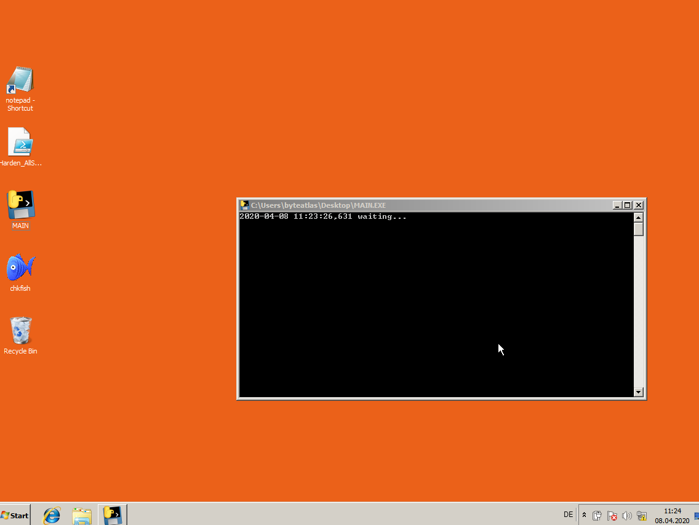

# RoAMer

This repository is the home of RoAMer, the "Robust Automatic Malware Unpacker". RoAMer is a generic malware unpacker based on dynamic analysis.

It is a generic unpacker based on dynamic analysis. The [paper](http://www.malwareconference.org/index.php/en/2019-malware-conference-proceedings/2019-malware-conference/session-3-un-packers-reverse-engineering-and-other-musings/roamer-the-robust-automated-malware-unpacker/detail) has been presented on MALWARE 2019.
Citation: Thorsten Jenke, Daniel Plohmann, and Elmar Padilla, "RoAMer: The Robust Automated Malware Unpacker," 2019 14th International Conference on Malicious and Unwanted Software (MALWARE), Nantucket, MA, USA, 2019, pp. 67-74.

This is still a very early version. 

## Setup
### Requirements and Pre-Setup
To run RoAMer you need to have a VirtualBox or KVM environment with a Windows Virtual Machine (VM) to unpack the malware on. So far, we have only tested RoAMer on Windows7 64Bit.

#### Virtual machine for upacking process
* Hardened VM: [example howto](https://byte-atlas.blogspot.com/2017/02/hardening-vbox-win7x64.html)
  * At least Firewall and Windows Defender need to be deactivated in the VM
  * Virtual Network, where the host system is able to communicate with the VM
* Python (virtual) environment (<= v3.7) that satisfies:
  * [pyinstaller](https://pypi.org/project/PyInstaller/)
  * [pywin32](https://pypi.org/project/pywin32/)

#### Host System
* Python3 (virtual) environment (>= v3.6)

### Compile on Windows VM
* clone the git repository
* execute `compile.bat` in Windows CMD, this will compile the python scripts into Windows executable files
* the executables can be found in unpacker/dist, pewhitelister/dist and receiver/dist

### Deployment
* run `PeHeaderWhitelister.exe C:\` in Windows CMD in the VM and copy the resulting `pe_header_whitelist.json` file of this script to the current VM's users home directory (`C:\Users\%username%\`)
* Copy the file `unpacker/dist/main.exe` from the VM to the host system into `$Repository/roamer/bin`
* start receiver ´main.exe´ in the VM within a command line terminal (cmd.exe) as an administrator
* move desktop the symbols so that the upper left corner of your desktop is free
* create a shortcut to notepad as the first icon directly below the free space (right click -> New -> Shortcut: `C:\Windows\notepad.exe`)
* open notepad with the new shortcut and move the notepad windows over the notepad shortcut icon, then close notepad
* create a snapshot of the VM in VirtualBox and name it e.g. `init`

Screenshot how the VM should look like at the end:

## Configuration
* check the host's config.py and set the `SNAPSHOT_NAME` (e.g. `init`) and `VM_NAME` (e.g. `win7box`)
* Set `host_ip`, `host_port`, `guest_ip`, `guest_port` to the correct values of your setup

### Check configuration
Make sure that the following files are existent in your setup:

VM:
  `C:\Users\%username%\pe_header_whitelist.json`

Host:
  `../RoAMer/roamer/bin/main.exe`

## How To Use
* Adjust config.py parameters as needed. The default configuration was the most successful as determined by the Thesis' evaluation.
* Just start /run.py <path_to_sample> and RoAMer will then do its magic in the VM and respond with the identified dumps.
 * The script will start the VM with the snapshot you've specified in `config.py`

## FAQ / Known issues
#### Why do I have to move the desktop icons away then place a notepad window there?
The unpacker is performing mouse moving and click actions, that malware is less likely to detect that it is going to be unpacked. The actions are in the left upper screen area, moving icons away prevents from starting several useless programs.

#### Whitelister script runs into "InvalidArgument" exception
This may occur when some broken exe files are located in you AppData or Windows Update directory, remove these corrupt files, then whitelister will run through.

#### Compatibility issues on Windows 10
RoAMer was originally developed to unpack on Windows 7 64Bit systems, we monitored some issues on Windows 10 that might or might not be critical for execution. We're currently working on resolving these issues.

#### Why is the malware not getting unpacked.
RoAMer is doing a really bad job at conveying information on why it was not able to unpack a given sample. We can offer, that you send us the sample and we check, why RoAMer was not able to unpack the malware. Maybe this leads us to the discovery of some bugs.

## Mentions
RoAMer was mentioned in [TA505's Box of Chocolate - On Hidden Gems packed with the TA505 Packer](https://www.telekom.com/en/blog/group/article/cybersecurity-ta505-s-box-of-chocolate-597672) by Thomas Barabosch.

## Sources
* The hooks have been designed with the help of  https://www.apriorit.com/dev-blog/160-apihooks
