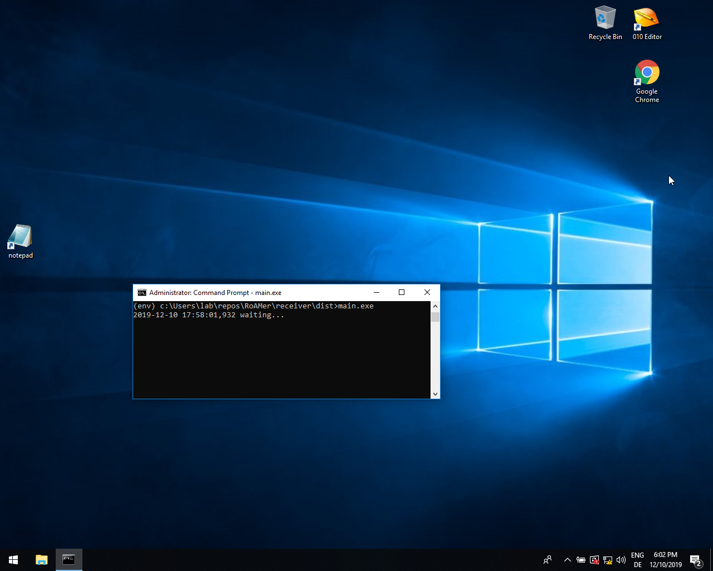

# RoAMer

This repository is the home of RoAMer, the "Robust Automatic Malware Unpacker".
RoAMer has been developed by Thorsten Jenke, with code contributions by Daniel Plohmann.

It is a generic unpacker based on dynamic analysis. The paper has been presented on MALWARE 2019 and will be released soonish.

This is still a very early version. Expect updates soon :)

## Setup
### Requirements and Pre-Setup
To run RoAMer you need to have a VirtualBox environment with a Windows VM to unpack the malware on. If we talk about VM in this howto, the windows machine is meant. If we talk about host system, your Linux/* system that is running the VirtualBox environment is meant.

#### Virtual machine for upacking process
* Hardened VM: [example howto](https://byte-atlas.blogspot.com/2017/02/hardening-vbox-win7x64.html)
  * At least Firewall and Windows Defender need to be deactivated in the VM
  * Virtual Network, where the host system is able to communicate with the VM
* Python (virtual) environment (> v3.7) that satisfies:
  * [pyinstaller](https://pypi.org/project/PyInstaller/)
  * [pywin32](https://pypi.org/project/pywin32/)
 
#### Host System
* Python (virtual) environment (> v3.7) 

### Compile on Windows VM
* clone git repo
* execute `compile.bat` in cmd
* compiled version can be found in unpacker/dist, pewhitelister/dist, and receiver/dist

### Deployment
* run `PeHeaderWhitelister.exe C:\` in cmd on VM and copy the resulting file of this script to the current VM's user home directory
* Copy from VM: unpacker/dist/main.exe to Host: roamer/bin
* start receiver ´main.exe´ in the VM within a command line terminal (cmd.exe) as an administrator 
* move desktop symbols so that the upper left corner is free
* create a shortcut to notepad as the first icon directly below the free space (right click -> New -> Shortcut: `C:\Windows\notepad.exe`)
* open notepad with the shortcut and move it over the notepad shortcut icon, then close notepad
* create snapshot and name it e.g. `init`

Screenshot how the VM should look like at the end:
 

## Configuration
* check the host's config.py for the `SNAPSHOT_NAME` (e.g. `init`) and `VM_NAME` (e.g. `win7box`)
* Set `host_ip`, `host_port`, `guest_ip`, `guest_port` to the correct values of your setup

### Check configuration
Make sure that the following files are existent in your setup:

VM:
  `C:\Users\%username%\pe_header_whitelist.json`
  
Host:
  `../RoAMer/roamer/bin/main.exe`

## How To Use
* Adjust config.py parameters as needed. The default configuration was the most successful as determined by the Thesis' evaluation.
* Just start /run.py <path_to_sample> and RoAMer will then do its magic in the VM and respond with the identified dumps.
 * The script will start the VM with the snapshot you've specified in `config.py`

## FAQ / Known issues
#### Why do I have to move the desktop icons away then place a notepad window there?
The unpacker is performing mouse moving and click actions, that malware is less likely to detect that it is going to be unpacked. The actions are in the left upper screen area, moving icons away prevents from starting several useless programs.

#### Whitelister script runs into "InvalidArgument" exception
This may occur when some broken exe files are located in you AppData or Windows Update directory, remove these corrupt files, then whitelister will run through.

#### Compatibility issues on Windows 10
RoAMer was originally developed to unpack on Windows 7 systems, we monitored some issues on Windows 10 that might or might not be critical for execution. We're currently working on resolving these issues.

## Sources
* The hooks have been designed with the help of https://www.apriorit.com/dev-blog/160-apihooks
